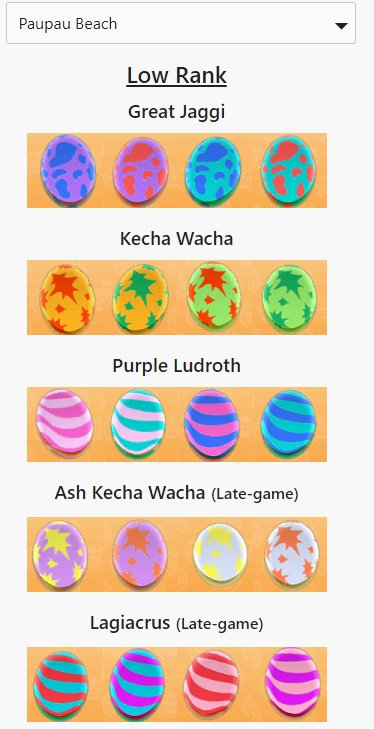

# Monster Hunter Stories: Egg Location Guide
Get a [visual list of which eggs are a zone](https://www.pondryhills.com/Eggs)! I had no idea which eggs belonged to which species, or were available in the current zone. The existing resources didn't group them in a way that was useful to me. 



I thought I might end up doing more with the website, but lost interest in the game shortly after finishing.

## Technical Stuff

It's a very small Single Page App using React. It certainly does not need to use any frameworks but I used it as a simple learning project.

### Prerequisites

- Node.js 8+ (may work on earlier versions)
- Yarn or npm

### Installing
Clone the repository and enter the directory
```
git clone git@github.com:alexcpendleton/pondryhills.com.git
cd pondryhills.com
```
Run your start script of choice
```
yarn start
```
or
```
npm run start
```

This will start a browser, and it should just work!

## Running the tests

```
yarn test
```
or
```
npm run test
```

## Deployment

This repository autodeploys via Travis CI to Google Firebase.

Consult the [create-react-app readme](https://github.com/facebookincubator/create-react-app) for setting up your own deployment. 

## Built With

* [React](https://reactjs.org/)
* [Create React App](https://github.com/facebookincubator/create-react-app)
* [mini.css](http://minicss.org/)
* [Travis CI](https://travis-ci.org/)

## Contributing

You are welcome to submit pull requests and issues, especially for data inaccuracies. 

## License

This project is licensed under the Unlicense - see the [LICENSE](LICENSE) file for details.